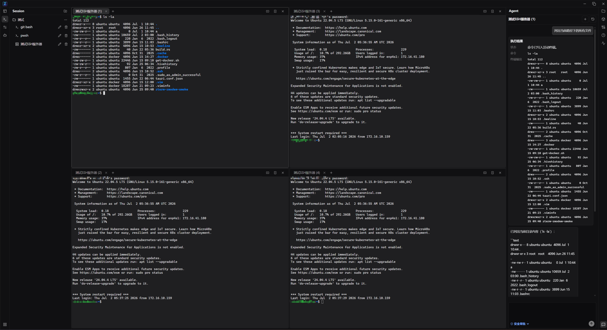
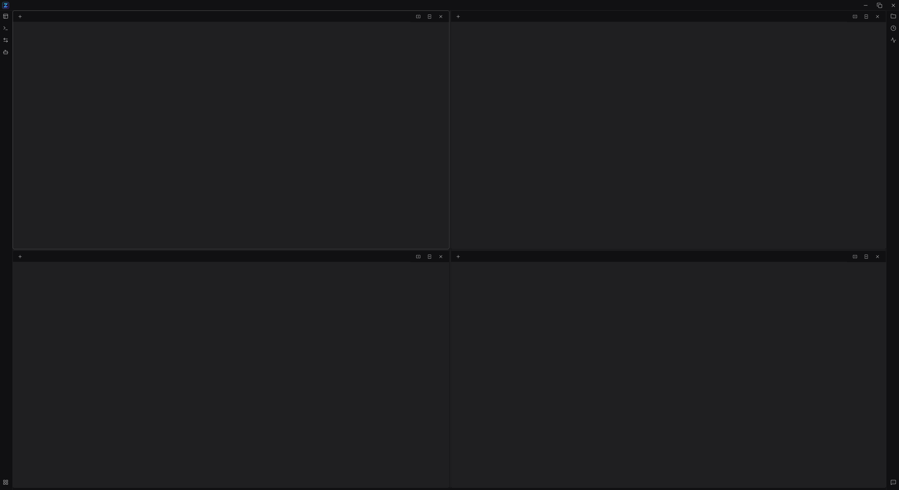
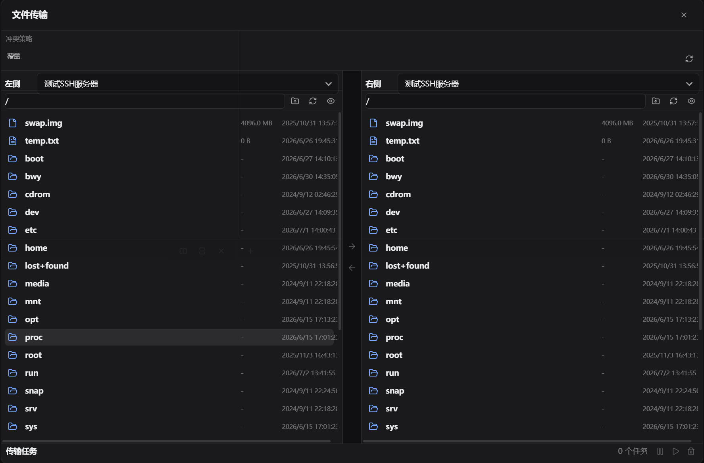
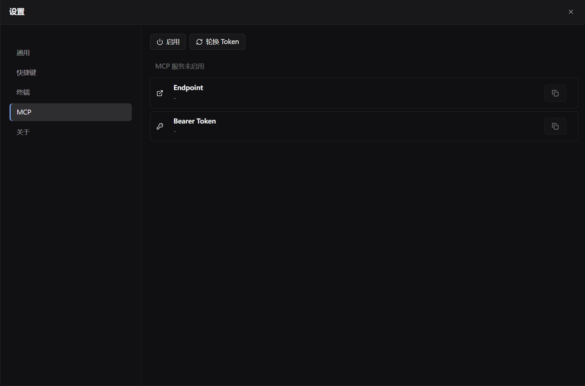

# zTerm

[中文](README.zh-CN.md)

zTerm is a Tauri desktop terminal workspace for SSH, SFTP, command history,
server monitoring, and AI-assisted operations. It is designed for a dense,
keyboard-friendly workstation layout: sessions on the left, split terminal
panes in the center, and files/history/monitor/AI tools on the right.



## Features

- Save, search, group, and open SSH/RDP/local terminal sessions.
- Run SSH sessions through the system OpenSSH client and render them with xterm.
- Use split terminal panes with tabs and workspace restore.
- Browse SFTP directories, create folders, upload, download, rename, delete, and retry transfers.
- Capture command history by session or local profile, search it, copy commands, and send commands back to the active terminal.
- Store credentials and AI provider API keys in the operating system keyring instead of plain SQLite rows.
- Use a local approval-based AI assistant panel for terminal context, risk hints, and candidate commands.
- Monitor SSH server CPU, memory, disk, load, uptime, and network traffic snapshots.

Current RDP support is a controlled placeholder and does not establish a real
RDP protocol connection. Cloud model invocation and remote agent orchestration
are intentionally outside the current public MVP.

## Screenshots







## Requirements

- Node.js `>=22.13`
- npm
- Rust stable toolchain
- Platform-specific Tauri system dependencies

Windows builds should use the MSVC Rust target
`x86_64-pc-windows-msvc` with Visual Studio Build Tools.

## Development

```bash
npm install
npm run dev
npm run typecheck
npm run test:frontend
npm run build
```

Rust and Tauri checks:

```bash
cd src-tauri
cargo fmt --check
cargo test
```

Desktop package build:

```bash
npm run tauri:build
```

## Releases

GitHub Actions builds release artifacts when a version tag is pushed:

```bash
git tag v0.1.0
git push origin v0.1.0
```

The release workflow builds four targets:

- Windows x64
- Linux x64
- Linux Arm64
- macOS Arm64

Unsigned macOS and Windows artifacts may show operating-system security prompts.
Code signing can be added later by configuring the relevant Tauri signing
secrets in GitHub Actions.

## Security Notes

Do not commit real hosts, usernames, passwords, API keys, private keys, tokens,
or smoke-test environment files. Local AI agent settings, internal project notes,
build output, runtime databases, and temporary credentials are ignored by
default.

## License

zTerm is licensed under the GNU General Public License version 3.0 only. See
[LICENSE](LICENSE) for details.

Third-party notices are listed in
[THIRD_PARTY_NOTICES.md](THIRD_PARTY_NOTICES.md).
